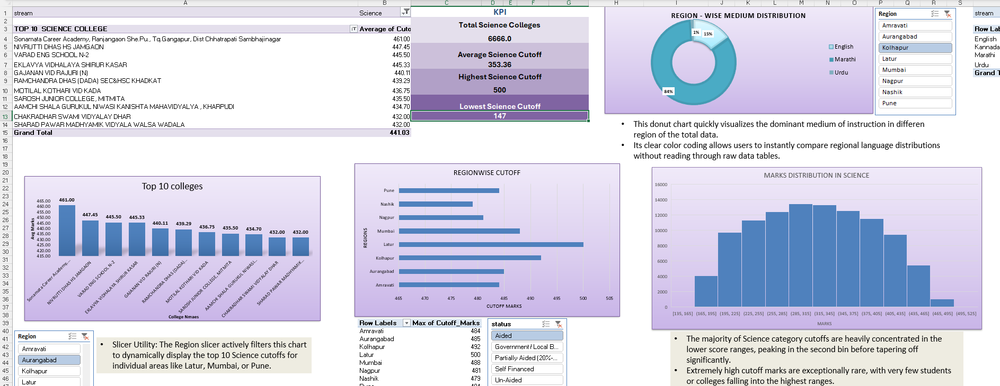
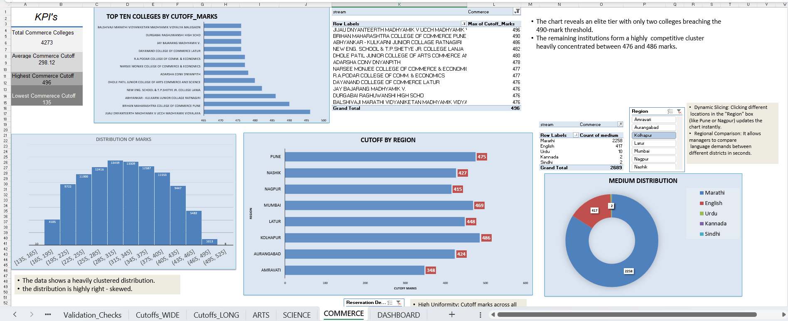
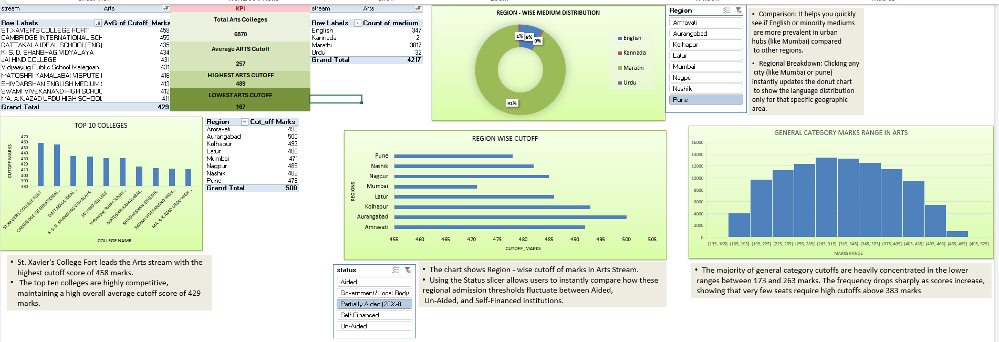

# Maharashtra FYJC Admission Cutoff Dashboard

An interactive Excel dashboard analyzing 99,295 government admission records from 
Maharashtra's FYJC (11th grade) Round 1 cutoff list — built to help students find 
realistic college options, and to surface demand patterns useful to institutions.

##  Dashboard Preview

### Overview Dashboard

### Science Stream

### Commerce Stream

### Arts Stream

## 🔍 Key Insights
- A ~43-mark average General-cutoff gap between Maharashtra's most competitive division 
  (Kolhapur) and its least competitive (Nagpur)
- Reserved-category students get into comparable colleges with marks roughly 45-50 points 
  below General category, on average — a measurable picture of how reservation outcomes 
  play out in practice
- Science is the most competitive stream (avg. cutoff 353), followed by Commerce (298) 
  and Arts (257)
- 9,602 unique colleges across 8 divisional regions offer FYJC admission in Round 1

## 🛠️ What Was Done
- Cleaned a 99,295-record dataset in Power Query, including identifying and fixing a 
  data-corruption issue caused by embedded line breaks in ~875 source records
- Engineered derived features (Region, Quota Type) and restructured data into a long 
  format for cross-dimensional analysis
- Built PivotTables, PivotCharts, slicers, and a box-and-whisker comparison across 
  college types
- Built a live "Eligible Colleges" lookup and percentile-rank tool so a student can 
  enter their marks and instantly see where they stand
- Validated every KPI against the underlying data — caught and corrected several 
  calculation and labeling bugs found during review (distinct-count errors, 
  mismatched filters, a mislabeled KPI)

## ⚙️ Tools Used
Excel (Power Query, Power Pivot, PivotTables, PivotCharts, Slicers)

## 📂 How to Use
Download the `.xlsx` file and open in Excel (2016+ recommended for full chart support). 
Use the slicers on each sheet to filter by region, category, or reservation type. Enter 
your marks in the Dashboard's Student Admission Analyzer to see your competitive standing.

## 🚧 Next Steps
Currently extending this analysis using SQL (joins, aggregations, window functions), 
and exploring a regression-based model to flag colleges with lower-than-expected demand 
relative to peers.

## 👤 Author
[Samiyah_Shaikh] — [www.linkedin.com/in/samiyahshaikh] — [samiyahshaikh33@gmail.com]
